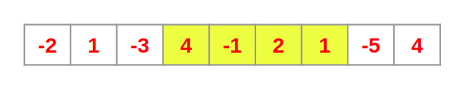

# Kadane’s Algorithm — (Dynamic Programming) — How and Why does it Work?


## Dynamic Programming
``` Those who cannot remember the past are condemned to repeat it. — Dynamic Programming ```


## Maximum Subarray Problem
The maximum subarray problem is the task of finding the largest possible sum of a contiguous subarray, within a given one-dimensional array A[1…n] of numbers.




## Brute Force Approach
One very obvious but not so good solution is to calculate the sum of every possible subarray and the maximum of those would be the solution. Note that every single element is a subarray itself.


We will call the maximum sum of subarrays starting with element `A[i]` the local_maximum at index `i`. Thus after going through all the indices, we would be left with local_maximum for all the indices. Finally, we can find the maximum of these local_maximums and we would get the final solution, i.e. the maximum sum possible. We would call this the global_maximum.

TC = O(n^2)


## Kadane’s Algorithm
In this section, we would use the brute force approach discussed above again, but this time we would start backward.


We would start from the last element and calculate the sum of every possible subarray ending with the element `A[n-1]`, as shown in the figure below. Then, we would calculate the sum of every possible subarray ending with `A[n-2]`, `A[n-3]` and so on up to `A[0]`.

Now let’s focus on the subarrays ending with the element A[4] (=-1) and A[5] (=2) shown in the figure below.


From the figure above, we see that the `local_maximum[4]` is equal to 3 which is the sum of the subarray `[4, -1]`. Now have a look at the subarrays ending with `A[5]`. You’ll notice that these subarrays can be divided into two parts, the subarrays ending with `A[4]` (highlighted with yellow) and the single element subarray `A[5]` (in green).

Let’s say somehow I know the `local_maximum[4]`. Then we see that to calculate the `local_maximum[5]`, we don’t need to compute the sum of all subarrays ending with `A[5]` since we already know the result from arrays ending with `A[4]`. Note that if array `[4, -1]` had the maximum sum, then we only need to check the arrays highlighted with the red arrows to calculate `local_maximum[5]`. And this leads us to the principle on which Kadane’s Algorithm works.


**local_maximum at index i is the maximum of `A[i]` and the sum of `A[i]` and local_maximum at index `i-1`.**


This way, at every index i, the problem boils down to finding the maximum of just two numbers, `A[i]` and `(A[i] + local_maximum[i-1])`. Thus the maximum subarray problem can be solved by solving these sub-problems of finding local_maximums recursively. Also, note that `local_maximum[0]` would be `A[0]` itself.

Using the above method, we need to iterate through the array just once, which is a lot better than our previous brute force approach. Or to be more precise, the time complexity of Kadane’s Algorithm is O(n).


---

## Reference:
[Medium Article by Rohit Singhal](https://medium.com/@rsinghal757/kadanes-algorithm-dynamic-programming-how-and-why-does-it-work-3fd8849ed73d)  

[Leetcode Question](https://leetcode.com/problems/maximum-subarray/)